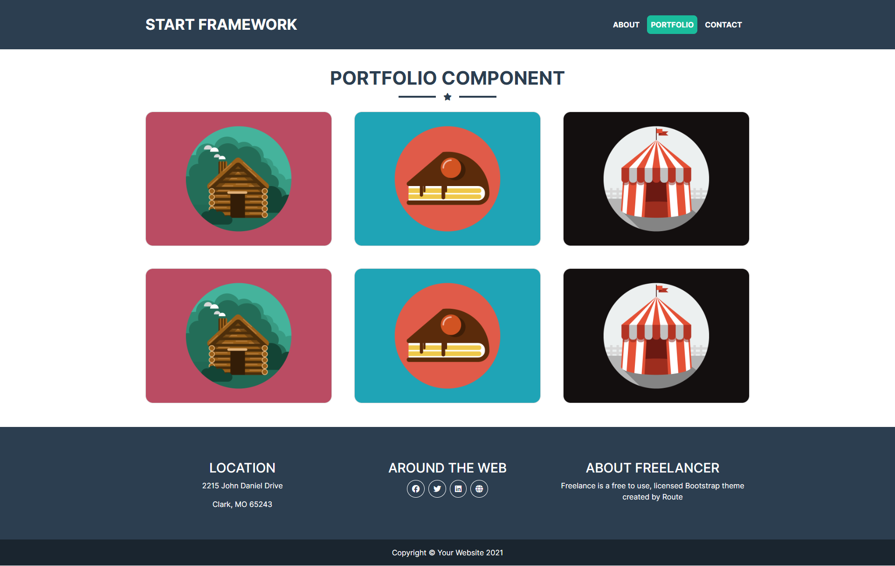
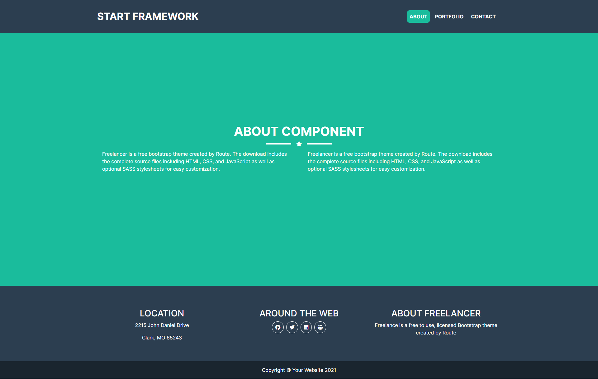
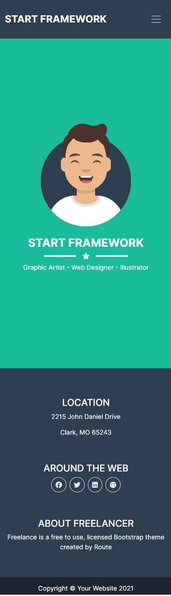
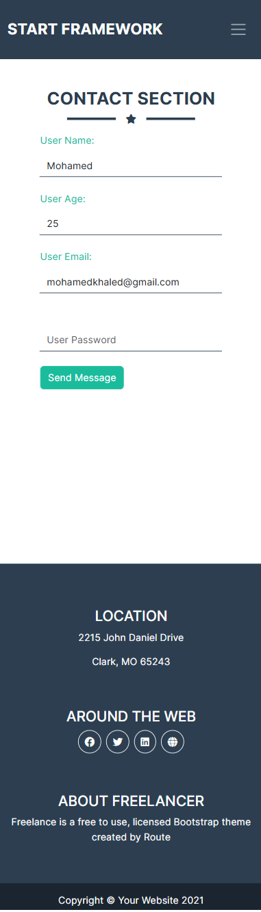

# React Portfolio Website

My first React project - A responsive portfolio website built with React and SASS, featuring a dynamic navbar, portfolio gallery with modal, and an interactive contact form.

## 📸 Screenshots

### Desktop View 🖥️
<div align="center">
  
  <br/>
  
</div>

### Mobile View Desktop 📱 
<div align="center">
  
  
</div>

## 🚀 Features

- **Navigation**
  - Smooth routing between components
  - Responsive navbar with animation
  - Dynamic padding on the scroll

- **Portfolio Gallery**
  - Grid layout with hover effects
  - Interactive modal view
  - Image showcase with overlay

- **Contact Form**
  - Floating label animations
  - Interactive input states
  - Responsive design

## 💻 Built With

- [React](https://reactjs.org/) - Main framework
- [React Router](https://reactrouter.com/) - Page routing
- [Bootstrap](https://getbootstrap.com/) - UI framework
- CSS/SCSS - Styling

## 📁 Project Structure

```
src/
├── components/
│   ├── About/
│   ├── Contact/
│   ├── Footer/
│   ├── Home/
│   ├── Layout/
│   ├── Navbar/
│   └── Portfolio/
├── assets/
│   └── images/
└── styles/
```
